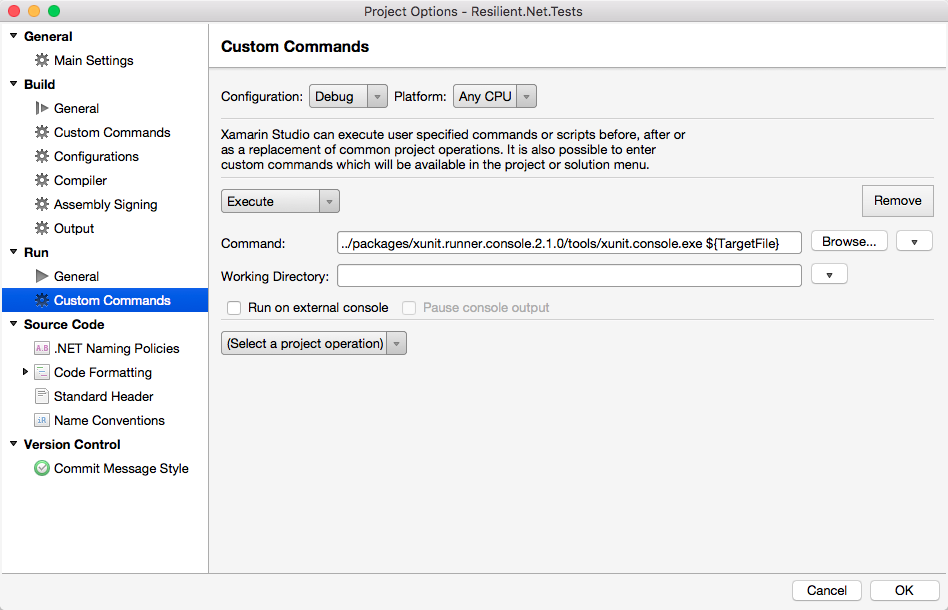

# Contributing

First off, glad you're here and want to contribute! :heart:

## Getting Started

To start you'll need to [fork this repo]. 

After that, the best thing to do would be to run the tests and make sure you're starting out in a good state.

## Making Changes

* Create a branch off of master
* Make focused commits with descriptive messages (rather than one giant one)
* Follow existing code conventions. This project follows [standard .NET conventions]
* Add tests that will fail without your code, and pass with it
* Push your branch and submit a pull request indicating the problem you're addressing and the solution you're proposing
* **Ping people on the PR!** - Most devs I know only get notifications if they're pinged directly (myself included)

## Running Tests

This project uses [xUnit] for testing. In Visual Studio this will all just work normally since the VS runner is included
in the project's NuGet dependencies.

If you're using Xamarin Studio (or something else), you can run the tests from the command line like this: 
(_multiline for clarity only_)

```bash
cd [WORKING_DIRECTORY]

# this should all be one line...
mono \
  ./packages/xunit.runner.console.*/tools/xunit.console.exe \
  ./Resilient.Net.Tests/bin/Release/Resilient.Net.Tests.dll
```

> **PRO TIP** You can setup a custom command for the test project to do this for you.

> 

[fork this repo]: https://github.com/pseudomuto/Resilient.Net/fork
[standard .NET conventions]: https://github.com/dotnet/corefx/blob/master/Documentation/coding-guidelines/coding-style.md
[xUnit]: http://xunit.github.io/
