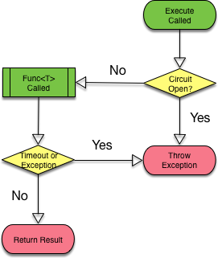

# Resilient.Net

[](https://travis-ci.org/pseudomuto/Resilient.Net)

A library to help make applications more resilient to failures.

[Circuit Breaker Pattern]: https://en.wikipedia.org/wiki/Circuit_breaker_design_pattern

## Circuit Breaker

The [Circuit Breaker Pattern] combines the goals of failing fast with timeouts.

The basic idea is that if a timeout (or other exception) occurs for a given resource, it's likely to happen again for
some amount of time. Instead of constantly hitting the timeout, which ties up all your threads, the resource is marked
as unavailable for some amount of time.  While unavailable, calls immediately trigger an exception.



### Circuit Breaker States

A circuit breaker can be in one of three states at any point in time. Transitioning from state to state is managed
automatically, however you can force a state using the `Force` method if necessary.

_**Closed**_

The call is made. If an exception is thrown, the error count is incremented. Once the threshold is reached the circuit
is opened.

_**Open**_

Calling `Execute` will immediately trigger an `OpenCircuitBreakerException` without attempting to call/query the
external resource.

After the `ResetTimeout` has lapsed, the circuit is moved to the half-open state.

_**Half Open**_

Calls are allowed through (one at a time) until the success threshold is reached, which will close the circuit. If an
exception occurs at any point, the circuit is opened again.

> **NOTE:** State is local to an instance of `CircuitBreaker`. However, all methods are thread-safe, which means it is
completely safe to keep a static instance around to share within your process.

### Monitoring

Circuit breaker state transitions are traced. To monitor the state of a breaker, you just need to [register a
`TraceListener`](https://msdn.microsoft.com/en-us/library/sk36c28t(v=vs.110).aspx) and do what you will with the log.

### Circuit Breaker Options

| Property | Description | Default |
|----------|-------------|---------|
| ErrorThreshold | The number of errors that must occur before opening the circuit | `2` |
| SuccessThreshold | The number of successful calls before the circuit is closed again | `2` |
| InvocationTimout | The amount of time to attempt the call/query | `1s` |
| ResetTimeout | The amount of time until trying the call/query again | `10s`

### Usage

```csharp
var options = new CircuitBreakerOptions {
    ErrorThreshold = 2,
    SuccessThreshold = 2,
    InvocationTimeout = TimeSpan.FromSeconds(1),
    ResetTimeout = TimeSpan.FromSeconds(10)
};

using(var breaker = new CircuitBreaker(TaskScheduler.Default, options))
{
    try
    {
        return breaker.Execute(() =>
        {
            // do something volatile...
            return "the result";
        });
    }
    catch(CircuitBreakerTimeoutException)
    {
      // fallback
    }
    catch(OpenCircuitBreakerException)
    {
      // fallback
    }
    catch(OTHER_EXCEPTIONS_YOU_CAN_HANDLE)
    {
      // fallback
    }
}
```

Having code like this sprinkled throughout your code base is kind of a bad thing. IMO, it's far better to wrap this
code in a primitive you can use instead.

#### For Example

```csharp
class JSONFetcher : IDisposable
    private readonly CircuitBreaker _breaker;

    public JSONFetcher()
    {
        // using default options and scheduler here...
        _breaker = new CircuitBreaker();
    }

    public string FetchString(url)
    {
        // validate url first...

        try
        {
            return _breaker.Execute(() =>
            {
                using(var client = new WebClient())
                {
                    return client.DownloadString(url);
                }
            });
        }
        catch(CircuitBreakerTimeoutException)
        {
        }
        catch(OpenCircuitBreakerException)
        {
        }
        catch(WebException)
        {
        }

        return null;
    }

    public void Dispose()
    {
        Dispose(true)
        GC.SupressFinalize(this);
    }

    protected virtual void Dispose(bool disposing)
    {
        if (disposing)
        {
            _breaker.Dispose();
        }
    }
end
```

Then this class can be used anywhere you fetch JSON strings like this:

```csharp
public class PostAPI
    private static readonly string s_host = "http://jsonplaceholder.typicode.com";
    private static readonly JSONFetcher s_fetcher = new JSONFetcher();

    public Post GetPost(ulong id)
    {
        var json = s_fetcher.FetchString(string.concat(s_host, "/posts/", id));
        if (json == null)
        {
            return null;
        }

        // convert to your model...
        return model;
    }
end
```
